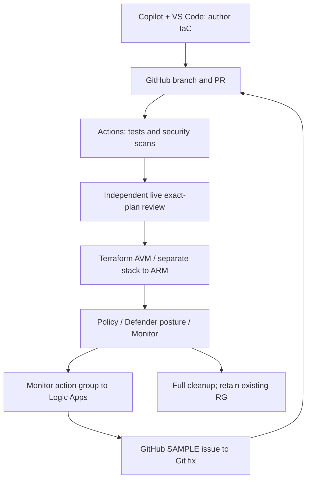

# DevSecOps for IaC — hands-on map

**15 September 2026: implementation map, not a live-run record.** Follow
[Microsoft's DevSecOps for infrastructure as code architecture](https://learn.microsoft.com/en-us/azure/architecture/solution-ideas/articles/devsecops-infrastructure-as-code)
with **Terraform Azure Verified Modules (AVM)** as the primary IaC. **Bicep is not
used; Microsoft Sentinel is excluded.** The custom learner baseline is not AVM.

Plain flow: **write → PR → test/scan → approved deployment → observe → issue →
fix/retest → full cleanup**. This is the intended learning flow, not one wired
pipeline. A monitoring issue is separate from AgentAlvine's guiding **Exercise**.

## Hands-on map

| Lab / component | What to do | Actual instructions / configuration |
| --- | --- | --- |
| 01 · GitHub, VS Code, Copilot | Challenge suggestions, record a request, inspect the diff/checks and merge the educational PR where allowed. | [Independent entry and lessons](https://github.com/alvinea28/ws2-github-copilot-laboratory-01/blob/dev/README.md) |
| 02 · Terraform AVM | Compose pinned VNet, named subnets and NSG modules in an existing RG. | [AVM profile](https://github.com/alvinea28/ws2-network-module-laboratory-02/blob/dev/avm/README.md) |
| 03 · Azure Policy | Observe the built-in tag policy with `DoNotEnforce`, fix tags, optionally test approved enforcement, then remove the assignment. Native AzureRM, not an invented Policy AVM. | [Hands-on](https://github.com/alvinea28/ws2-subnet-security-laboratory-03/blob/dev/docs/policy-hands-on.md) · [Governance profile](https://github.com/alvinea28/ws2-subnet-security-laboratory-03/blob/dev/governance/README.md) |
| 04 · GitHub Advanced Security | Inspect dependency review, supported-language CodeQL, Terraform/IaC scanner findings and secret protection; fix/rescan safely. CodeQL does not scan HCL. | [Security hands-on](https://github.com/alvinea28/ws2-terraform-tests-docs-laboratory-04/blob/dev/docs/security-hands-on.md) |
| 05 · Azure Resource Manager (ARM) and stacks | Inspect stack ownership, approved deny-setting changes and full deletion. Terraform/AzAPI supplies ARM JSON for a separate VNet: **not AVM, not Bicep, no AVM adoption**. | [Stack profile](https://github.com/alvinea28/ws2-module-release-consumer-laboratory-05/blob/dev/stack/README.md) |
| 06 · Actions and Defender DevOps | Scan IaC, inspect the corresponding ingested finding, fix and rescan; source scanning is not deployed posture. | [Defender DevOps hands-on](https://github.com/alvinea28/ws2-github-actions-ci-laboratory-06/blob/dev/docs/defender-devops-hands-on.md) |
| 07 · Entra OIDC/RBAC, state, delivery and Defender posture | Use the existing protected writer; inspect an actual workload recommendation, remediate through Git and verify cleanup. | [Posture hands-on](https://github.com/alvinea28/ws2-azure-delivery-laboratory-07/blob/dev/docs/defender-posture-hands-on.md) · [Preflight](https://github.com/alvinea28/ws2-azure-delivery-laboratory-07/blob/dev/docs/instructor-preflight.md) |
| 08 · Monitor, action group, Logic Apps and GitHub Issues | Native AzureRM alert/action group feeds AVM workflow/connection. Test SAMPLE routing, distinguish a real VNet event, make the Git fix and clean up. | [Feedback hands-on](https://github.com/alvinea28/ws2-operations-capstone-laboratory-08/blob/dev/docs/monitor-feedback-hands-on.md) · [Monitoring profile](https://github.com/alvinea28/ws2-operations-capstone-laboratory-08/blob/dev/monitoring/README.md) |

Service companions are **outside the original 33 graded activities**. Their
instructions and authoring checks are not extra Exercise completions.

## Verified versions and current authoring checks

Published module requirements reviewed on **15 September 2026**:

| Pinned Terraform AVM | Relevant provider / Terraform requirements |
| --- | --- |
| [VNet 0.22.2](https://registry.terraform.io/modules/Azure/avm-res-network-virtualnetwork/azurerm/0.22.2) | Terraform `>=1.9,<2.0`; AzAPI `~>2.12`; RG supplied as `parent_id` |
| [NSG 0.5.1](https://registry.terraform.io/modules/Azure/avm-res-network-networksecuritygroup/azurerm/0.5.1) | AzureRM `~>4.0`; AzAPI `~>2.4` |
| [Logic workflow 0.1.2](https://registry.terraform.io/modules/Azure/avm-res-logic-workflow/azurerm/0.1.2) | AzureRM `>=4.21.1,<5.0.0`; AzAPI `~>2.0` |
| [Web connection 0.1.0](https://registry.terraform.io/modules/Azure/avm-res-web-connection/azurerm/0.1.0) | AzureRM `~>4.0,<5.0.0`; AzAPI `~>2.4` |

All four roots pin Terraform **1.16.1**. AzureRM roots select **4.81.0**; AzAPI,
where used, is **2.12.0**. Keep their own locks/state and the incompatible custom
baseline **5.4.0** unchanged. Windows/Linux provider lock hashes are supplied.
Never edit downloaded module constraints or bypass readonly locks.

**Implemented/checked:** actual AVM, governance, stack and monitoring roots plus
[profile-specific CI](../full-ws-content/README.md#separate-service-companions--authoring-checks-not-exercise-grades).
CI checks formatting, backend-disabled read-only initialization, schema validation
and exactly **3 / 2 / 2 / 2** mocked cases. Earlier local init/validate and **9 mock
contracts passed**, with no failures/errors/skips; none were rerun for this docs edit.
These checks grade configuration contracts, **not Azure or participant completion**.

**Not executed/proved:** live deployment, OAuth consent, finding ingestion,
alert delivery, monitoring-issue creation, stack deletion or workload cleanup.
The four roots are **not wired into baseline Lab 07's workflow**; each needs its
own reviewed live route/backend/preflight before use, not a folder substitution.

## Owner prerequisites before live actions

- **Private GHAS:** confirm paid Team/Enterprise and the relevant Code Security /
  Secret Protection entitlement, admin authority and budget; Copilot is not that
  license. [Availability](https://docs.github.com/en/get-started/learning-about-github/about-github-advanced-security).
- **Defender DevOps:** require Azure connector authority and a GitHub organization
  owner for installation/consent. Reuse the approved connector/scope; discovery may
  take **up to eight hours**, with variable finding latency. GHAS is not the license
  for Defender findings. [Onboarding](https://learn.microsoft.com/en-us/azure/defender-for-cloud/quickstart-onboard-github).
- **Policy/stacks:** confirm dedicated existing-RG assignment and stack deny-setting
  permissions; Contributor/read access alone is insufficient. No role expansion.
- **Monitor/Logic Apps:** confirm region, costs and owner consent on the existing
  Terraform-created connection. Use the [GitHub connector's Create an issue action](https://learn.microsoft.com/en-us/connectors/github/),
  **not issue triggers unsupported for organization repositories**. The callback
  is sensitive state: require encrypted/locked restricted state and encrypted plans.
  A SAMPLE action-group test is routing evidence, not detection or a real incident.

In **01/05**, inspect your own diff/current checks and merge your educational PR
only where repository rules permit. **GitHub cannot self-approve**; required
nonauthor reviews remain. **Protected live 07 is not solo:** retain protected main,
distinct identities and independent exact-plan/deploy/destroy approvals. PR checks
have **no Azure/OIDC/state access**. Missing prerequisites stay blocked, never passed.

## One owner per resource; full cleanup

AVM owns its network; governance owns only its assignment; monitoring owns only
its connection, workflow, action group and alert. Terraform/AzAPI owns the stack
object; its ARM JSON template owns a **separate VNet**, never the AVM workload.
Use each original approved writer/root/state and a **fresh full reviewed destroy
plan**, then verify state **and Azure inventory**, including stack child removal.
No targets, state deletion, `detachAll`, broad RG deletion or out-of-sync bypass.
Retain the existing RG, backend, identities, runner and original/shared Defender
settings; remove only exclusively lab-owned connectors. Uncertain cleanup stays open.

[Participant start and own Azure guides](../README.md) · [Historical review](../full-ws-content/README.md)
No cloud actions or permission changes occur in this documentation update.
Maintenance is **dev only**; **main publication is prohibited**.
